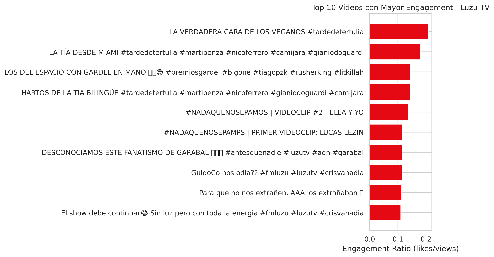
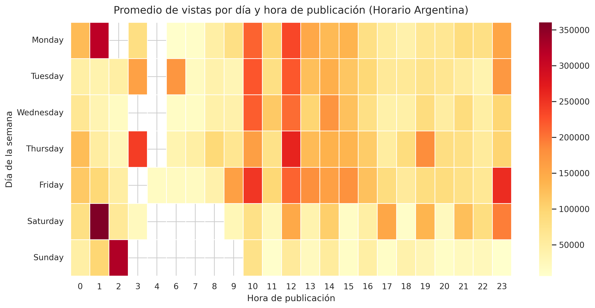
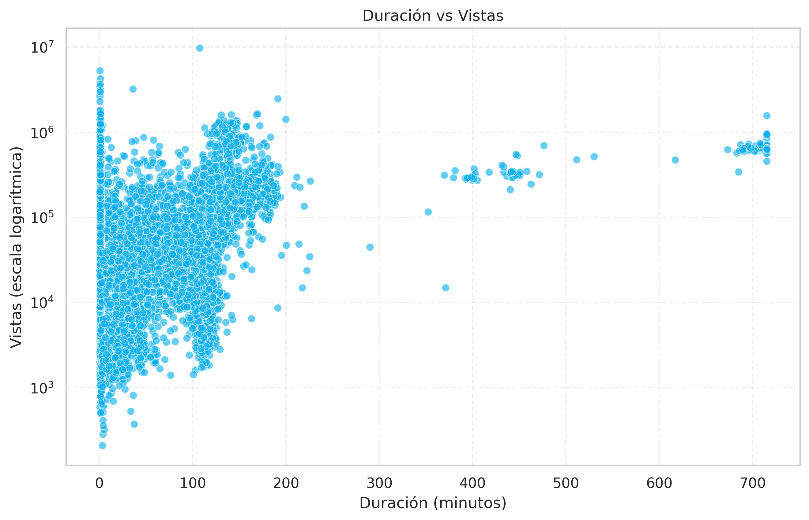
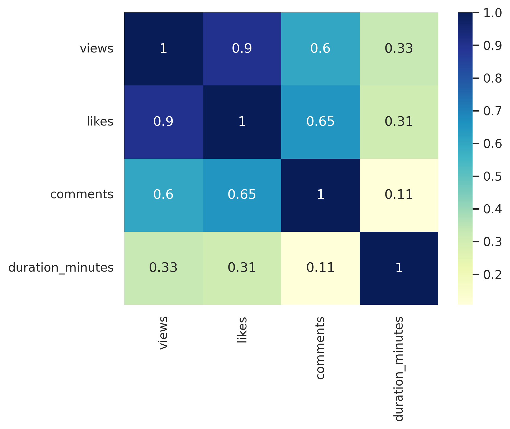
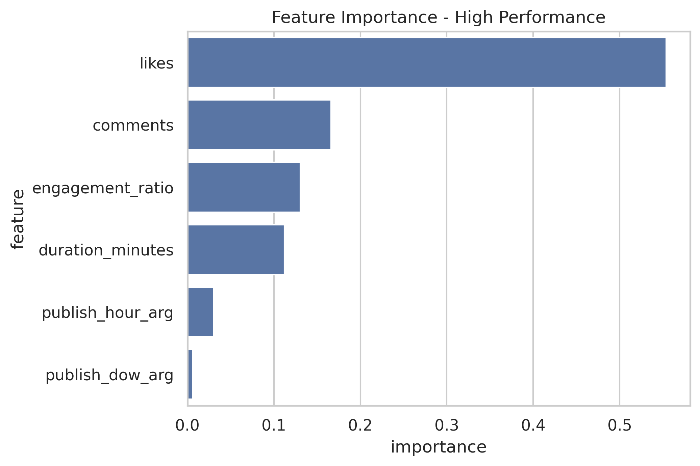

# **Luzu TV — Performance Analysis**

Analysis of the performance of Luzu TV’s content using data extracted directly from the YouTube Data API.  
The goal is to identify audience patterns, engagement levels, program differences, and long-term growth trends.

---

## **Data Source**

All data is obtained through the **YouTube Data API v3**, using Python to request, collect, and process information dynamically.

This repository does **not** include local CSV files — the notebook retrieves all data directly from the API.

---

## **Objectives**

- Evaluate the performance of each program on the channel.  
- Analyze views, likes, engagement, and audience growth.  
- Identify weekly, hourly, and seasonal patterns.  
- Detect audience spikes and explore potential causes.  
- Build and evaluate a predictive model estimating the probability that a video surpasses specific view thresholds.

---

## **Tech Stack**

- **Python**  
- **Pandas, NumPy**  
- **Matplotlib, Seaborn**  
- **Requests**  
- **google-api-python-client**  
- **Google Colab**

---

## **Repository Structure**

```
/notebooks          → Full analysis notebook (.ipynb)
/presentation       → Presentation of the report (PDF)
/requirements.txt   → Libraries required to reproduce the project
```

---

## **Main Findings**

### **Content Insights**

- **Topics & tone:** Humorous, conversational, or controversial themes generate the highest engagement.  
  ➤ *Recommendation:* Keep titles natural and maintain conversational formats.

- **Optimal duration:** Top-performing videos typically last **60–150 minutes**.  
  ➤ *Recommendation:* Maintain this length range except for special events.

- **Publishing timing:** **Thursdays and Fridays** show the best overall performance.  
  ➤ *Recommendation:* Prioritize important releases on those days.

- **Primary engagement driver:** Early audience reaction (initial likes & comments) is key.  
  ➤ *Recommendation:* Encourage early interaction within the first hours of posting.

- **Hourly patterns:** Views tend to peak during the morning and midday, decreasing toward nighttime.

- **Event spikes:** Significant peaks align with special shows or viral moments.

---

### **Predictive Model Conclusions**

- Early engagement strongly predicts whether a video surpasses **100k views**.  
- Video length has a moderate but consistent impact.  
- Day and time matter, but less than audience reaction patterns.  
- Audience behavior is cyclical and stable over time, making prediction feasible.

---

## Key Visualizations

Below are the most relevant visualizations that helped uncover meaningful patterns in the dataset and informed the final insights of the analysis.

### **1. Top Engagement Videos**
This bar chart highlights which videos achieved the highest engagement, helping identify the types of content that resonate most with the audience.



---

### **2. Views by Day and Hour (Heatmap)**
The heatmap reveals clear temporal patterns, showing the days and hours with the highest viewership. This helps determine the optimal posting times for maximizing reach.



---

### **3. Duration vs Views**
This scatter plot explores the relationship between video length and total views, helping determine whether longer or shorter videos tend to perform better.



---

### **4. Correlation Heatmap**
The correlation matrix provides an overview of how numerical features relate to each other and to performance metrics, guiding feature selection for modeling.



---

### **5. Feature Importance (Model Output)**
This plot highlights which variables contributed most to the predictive model, supporting data-driven decisions about what factors most influence video performance.



---

### **See all visualizations**
All generated figures — including exploratory analysis plots and additional metrics — can be found in the dedicated folder:

**`/figures/`**

This folder contains every PNG exported during the analysis, allowing you to explore the full set of visual insights used throughout the project.

---

## **How to Reproduce the Analysis**

1. Clone or download this repository.  
2. Install dependencies:

   ```bash
   pip install -r requirements.txt
   ```

3. Run the notebook:

   ```
   /notebooks/luzu_performance_analysis.ipynb
   ```
